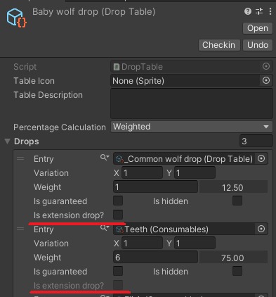

# Overview


​	This overview was designed to provide you with the necessary information to fully understand how this plugin work, also create a terminology to help you to understand what something does just by seeing it's name. You can also find a small guide to demo inside the Demo folder that will provide you with an explanation about what each sample tries to demonstrate, it's a good way to understand it by looking directly at the commented code, if you are getting trouble understanding some specific API, just hit me up in discord and I'll try my best to help.

---

## Core concepts

### Core classes:

- **Drop table:** This is the drop container and control the calculation used thought the drops inside it (see below for more information about percentage calculation kind), also it's from here that you will control the *drops* properties, aside from other additional, for more specific cases, settings. It's inherit from scriptable object so you can create it the right-click context - **right-click -> Create -> Drops -> New Table** -. This has not only your drops but also the callbacks, modifier, and filters (we will talk more about these in the specific section), and it's from where you will request drops.
- **Drops:** A layer representing your drop settings, can only be accessed thought the drop table (on the inspector), controlling things like your entry, percentage to drop, amount variation, and other additional settings.

Those classes above you, probably, will change thought the inspector to setup your scenario, below we have classes that represent the answer of some requested operation and only exist in the code side.

- **Bag:** This is a container of *Loot*, when you request a drop from your *Drop table* you will get a Bag as result.
- **Loot:** This is a limited version of the drop that contains only the entry and the collapsed dropped amount (if your *drop* can vary between 3~7 units when randomized a *loot* will have a single value between the selected range), when you iterate over *Bag* you'll get *Loot*.

---

### Dropping

You can ask for drop through two different APIs

1. [Drop](./../api/Loot.DropTable.html#Loot_DropTable_Drop_System_Int32_): The easiest way, this will give your a result bag based on your table configuration, you can ask for multiple drops changing the value of N
2. [Custom drop](Loot.DropTable.html#Loot_DropTable_CustomDrop_System_Int32_System_Func_System_Collections_Generic_List_Loot_Drop__Loot_Bag__System_Action_Loot_Context_DroppingContext__System_Action_Loot_Context_DroppedContext__): Here you can specify custom behaviors for multiple purpose, like getting the whole control about how drops happen providing a ```Func<List<Drop>, Bag>```, overwrite the `OnDropping` and `OnDropped` from table passing new callbacks through `beforeDropCallback` and `afterDropCallback`. The modifiers and filter will still being applied

---

### Modifier / Filter

We need to be able to modify and filter the drops at runtime. **Loot** has some events exposed to allow you to control the final outcome of a table, those events run in a specific order, let's see this order and then talk a little about each of them.

<div align="center"> **Global modify** => **Global modified** => **Local modify** => **Local modified** => **Table filter**</div>

#### Global modify

- Applied to **all** tables
- It is invoked **one time for each entry** in the table requesting it
- It will provide context information though a [Modify context](./../api/Loot.Context.ModifyContext.html)
- Should be registered though **class** 

```c#
private void Awake()
    => DropTable.OnGlobalModify += DoubleCurrenciesAmount;

// RULE: Drop 2x for each drop of currency type
private void DoubleCurrenciesAmount (ModifyContext ctx)
{
    var currentDrop = ctx.CurrentDrop;

    if (!(currentDrop.Entry is Currency))
        return;
    
    currentDrop.AmountRange *= 2;
}
```


#### Global modified

Note that most operations that could be done in **Modified** could also be done on **Modify** instead, but this event is called just one time per table, so if your rule is relying on some calculation, maybe is a good idea to add it here instead of on **Modify**

* Applied to **all** tables
* It is invoked **one time per table** requesting it
* It will provide context information though a [Modified context](./../api/Loot.Context.ModifiedContext.html)
* Should be register though **class**

```c#
private void Awake()
    => DropTable.OnGlobalModified += MyCustomModified;

// If this table have 2 or more card, all MISC type items will get a bonus of flat 10% in drop chance
private void MyCustomModified (ModifiedContext ctx)
{
    var modifiedDrops = ctx.ModifiedDrops;
    
    // We are using ModifIED here instead of ModifY, cause we don't want to count amount of cards for each item that we go though
    var amountOfCards = modifiedDrops
        .Count(d => d.Entry is Misc m && m.name.ToUpper().Contains("CARD"));
            
    if (amountOfCards < 2)
        return;

    var miscList = modifiedDrops
        .Where(d => d.Entry is Misc);
            
    foreach (var drop in miscList)
        drop.Percentage += 10f;
}
```


#### Local modify

- Applied to **referenced** table
- It is invoked **one time for each entry** in the table requesting it
- It will provide context information though a [Modify context](./../api/Loot.Context.ModifyContext.html)
- Should be registered though **instance** 

```c#
public DropTable monsterTable;

private void Awake()
    => monsterTable.OnLocalModify += GuaranteeCurrency;

// All CURRENCY that have COIN in name will be guaranteed to drop
private void GuaranteeCurrency (ModifyContext ctx)
{
    var currentDrop = ctx.CurrentDrop;

    if (!(currentDrop.Entry is Currency))
        return;

    if (!currentDrop.Entry.name.ToUpper().Contains("COIN"))
        return;

    currentDrop.IsGuaranteed = true;
}
```


#### Local modified

Similar to global modified but its applied only only the current referenced table instead of all

* Applied to **referenced** table
* It is invoked **one time per table** requesting it
* It will provide context information though a [Modified context](./../api/Loot.Context.ModifiedContext.html)
* Should be register though **instance**

``` c#
public DropTable monsterTable;

private void Awake()
    => monsterTable.OnLocalModified += MyCustomModified;

private void MyCustomModified (ModifiedContext ctx)
	=>  // TODO: think in a sample to insert here \o/
```


#### Table filter

This operation will filter your table using ```Predicate<Drop, bool>```, keep in mind that the item **must** pass thought **all filter** to appear in the iteration

- Applied to **referenced** table
- It is invoked **one time for each entry** in the table requesting it
- It will provide the current [Drop](./../api/Loot.Drop.html) though callback signature
- Should be registered though **instance** 

```c#
public DropTable monsterTable;

private void Awake()
    => monsterTable.AddFilter(MyFilterRule);

// If player is cursed, show only cursed items
// If player is not cursed show only no cursed items
private bool MyFilterRule (Drop drop)
    => drop.Entry is Item item 
       && item.cursed == player.IsCursed;
```


---

## Additional concepts

Let's take a look at some additional important concepts that reside inside **Loot**:

### Percentage calculation

In the drop table inspector we can see an enum field called **percentage calculation**. This field will change the way that drop percentage/chance is calculated 

<div align="center">
    
</div>

* **Simple:** Each drop has its percentage individually, this means that when we ask for a drop, the table will try to drop each entry individually. 
  **i.e.** suppose that we have two drops A and B, and each one has 50% to be dropped, when we ask for a drop, our result bag can have A, A and B, B or nothing (empty bag), also as the entries are independent changing the percentage of one entry will not interfere in another percentage.

- **Weighted:** The percentage of each drop depends on the sum of the weight of each item, and the sum of all percentages should always be 100%, this also means that when we ask for a drop the table will give to us only one drop from the list. 
  **i.e.** continuing with our A and B example, if each one weights 1, this means that each has 50% to be dropped, our result bag possibilities are A or B, also if we change our B to weight 2 this will make our A change from 50% to 33% and our B change from 50% to 66%, because the sum of weighs is 3, A percentage is equal to their weight (1) divided by the table weight (3), so A = 1/3 = 33% and B = 2/3 = 66%.

---

### Guaranteed 

Toggling it will make your drop always drop. 

Note that requesting a drop from a **weight table** that has guaranteed drops will give to you a **bag** with **all the guaranteed drops** plus **one of the non-guaranteed drops**.

Also take in count that it will remove the drop from the total weight sum, as you can see in the gif below.

<p align="center"> </p>

---

### Hidden

Toggling it will make your drop to **not** appear on iterations, will **not** be able to be dropped and also, as expected, will not be take in count for weighted tables. Think in it like an secret drop that will have a chance to drop just when player makes a specific action.

<div align="center"> 
     
</div>

---

### Extension drop

​	This feature is created to allow you to have hierarchy drops mixing multiple drop tables and treat all then as a unique table. Take the following example in count: in your game every <u>wolf</u> drops a *fur*, also every <u>baby wolf</u> drops a *teeth* then you have a <u>Blue Baby wolf</u> enemy that, as the name suggests, drops things from <u>wolf table</u>,  <u>baby wolf table</u> and also some custom items specific from this kind of wolf. You can toggle this feature into the drop on inspector:

<div align="center"> </div>

**Important:** Note that we can enable it on *_Common wolf drop* entry and can't on *Teeth* entry. This option will be enabled only when the entry is another **Drop Table** AND the [percentage calculation](./overview.md#percentage-calculation) between two table are equal.

When this option is enabled the entry will not be treated as a drop (so you will not get it when iterating over this table, instead you will get the union between two drop tables), and in the case that your table is a weighted one, the weight from inner tables will interfere in outer tables, as we can see in the following gif.


---

### Enumerators

​	We provide some enumerators to allow you to have different views of the current table, you can change the view altering fields of the [Filter](./../api/Loot.Enum.Filter.html) when calling a custom enumerator or can use some of the our pre made enumerators.

#### Default enumerator

This is our implementation of ```IEnumerable<Drop>```, it will internally call the default behavior of the *custom enumerator* that is:

* Include all drops that isn't hidden nor extensions
* Open all extension drops until we have none of them OR have reach at max depth, this maximum can be changed on [Loot.Settings](./../api/Loot.LootSettings.html)
* While opening extensions **skip** tables that are already added (check repetition by table reference)
* Remove all drops marked as [hidden](./overview.md#hidden)
* Clone all drops and
* Apply all the modifiers and filter

**NOTE:** modifiers and filters are applied on runtime only, so calls used in the editor will skip those invocations

```c#
foreach (var drop in monsterTable)
{
    // Do something...
}
```


#### Raw enumerator

A sugar to give you a copy of your drops as you see them in the drop table inspector

* Included drops still a cloned version of original drops
* Do not open extensions, so will your receive just the properly extension drop
* As we don't open extensions we check for repetitions
* Include hidden drops
* Does **NOT** apply any modifier or filter

```c#
foreach (var drop in monsterTable.RawEnumerator())
{
    // Funny operations...    
}
```


#### Custom enumerator

This is the base enumerator that others will rely on, all of them call this enumerator using custom filter settings, but you can call it yourself and set the view that you want to receive, for example

```c#
var myCustomFilterSettings = Filter.IncludeHiddenDrops | Filter.DontInvokeLocalModify | Filter.DontInvokeLocalModified;
foreach (var drop in monsterTable.CustomEnumerator(myCustomFilterSettings)) { }
```

here we will receive the default behavior with the following changes

- We will **include** drops marked as [hidden](./overview.md#hidden)
- We will skip the invocation of **local modifiers** 
