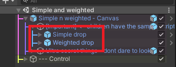

# Sample instruction

---

This is a small section of the document that will provide a brief explanation about what the samples try to shown. You can navigate thought the samples using the right menu.

## Simple and weighted

​	Here we have the most basic case, a simple scenario with a list of items with an arbitrary percentages. This sample set this list into two different drop tables (one for a simple table and a second for a weighted table) then request a drop and show the results into the log.

Both sample (simple and weighted) use the same component ```BasicSample.cs``` the only difference is that table referenced



## Hierarchy drop

​	Here I'm trying to shown how to setup drops that are other tables to be used as an extension of the current table. Each of the following containers have a sample script with the drop table linked, you can look to tables to understand how this was set up.


